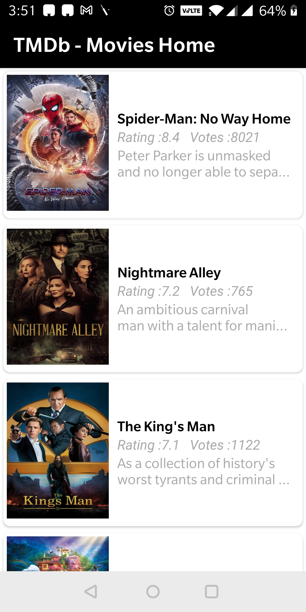
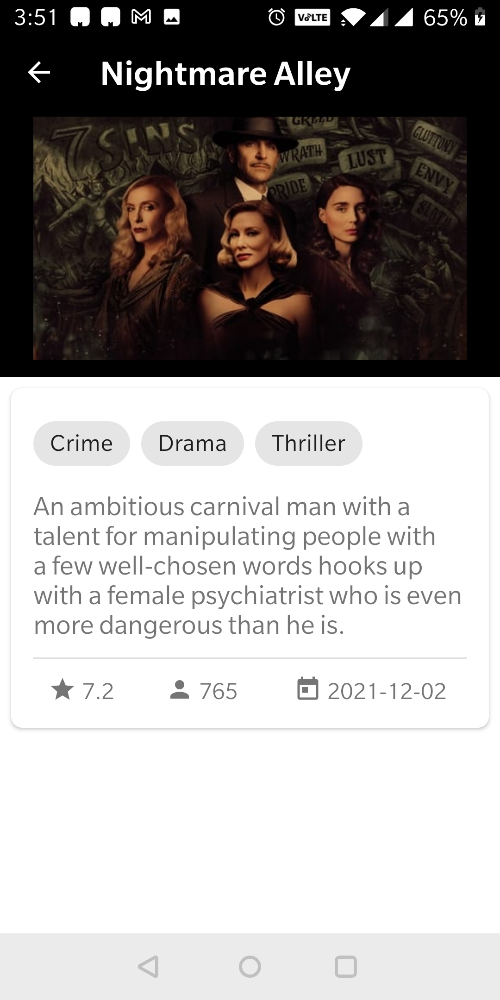
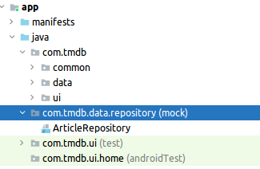
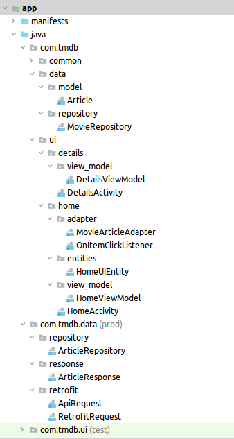

# About the project
Application shows list of top 20 popular movies using poster images, movie titles and description. It further shows details like movie overview, rating, number of votes, release date, along with movie backdrop image and title for respective selected movie from the list.

## Architecture overview
The application is build based on MVVM pattern using below android architecture components:

- LiveData and ViewModel. ViewModel exposes LiveData which are consumed by views.
- RxJava. Repository exposes observables from repository which are consumed by viewModel.
- Butterknife
- Retrofit for consuming rest api data from (for consuming rest api data from 'https://developers.themoviedb.org/3/'.

    
      

 [View]  --(Livedata)-->   [ViewModel]   --(RxJava Observables)-->    [Repo1]/[Repo2]/[Repo3] 
                                                   
				      .
				      
## Demo

root folder [TMDB]

apk:
	mock: 
	prod: 

Videos:
	Mock : demo/videos/mock.mp4
 	Prod : demo/videos/prod.mp4

Images: 
	home screen: 
	details screen: 

## Project strucutre
Added two build flavours
1. Mock
For UI development where we create MVVM bridge and expose interface for repository and respective observables and livedata. 
We implement the repository interface and send Mock data over MVVM bridge using exposd RxJava observables from repository(signature can be found in Repository interface) and exposed livedata from viemodel which is consumed by view.
2. Prod
We implement repository interface and actually consume webservices from prod repository when they are ready.

In order to add above build flavours add above code in gradle:

'
productFlavors {
        mock {
            dimension "mode"
        }
        prod {
            dimension "mode"
        }
    }

    // Disable release variant for Mock flavor. This configuration will never hava a release.
    variantFilter { variant ->
        def names = variant.flavors*.name
        if (variant.buildType.name == 'release' && names.contains("mock")) {
            setIgnore(true)
        }
    }
'

When we added above build flavours, it created 3 different build-variants:
1. mockDebug (disabled release variant as shown above)
2. prodDebug
3. prodRelease

### Folder structure
It created below folder structue at source (src root) level:

1. main
2. mock (mock repository implementation)
3. prod (prod repository implementation)
4. test
5. androidtest

For mock variant, main and mock folders are included and prod is excluded. 
	[main]
	[mock]

Similarly for prod variant, main and prod folders are included and mock is excluded.
	[main]
	[prod]

Folder arrangement for MVVM:
root folder [main]
		[com.tmdb]
			[common]   --> common files for constants, base classes for activity and viewmodel.
			[data]     --> model or pojo defination, interface for repository which defines signature for implementation for prod and mock.
                 	[ui]       --> for views, viewadapters, viewmodels, viewEntities per screen
				
root folder [prod]
		[com.tmdb.data] --> for repository implementation and consuming web services
root folder [mock]
		[com.tmdb.data] --> for repository implementation and mock data

### PreFixes used to segregate dependencies based on build flavours
In order to add dependencies respective to build flavours we use below prefixes:

implementation 'org...' -> for all build flavours or variants
prodImplementation 'retrofit' -> for prod varient or flavour. We add dependency for retrofit under prod for consuming webservices, which is not needed for mock.
mockImplementation '...' -> for mock varient or flavour.

## Dependencies

We added dependencies for integrating below librarires:

- Butterknife (view binding)
- glide (image loading)
- RxJava (RxJava Observables)
- guava (google provided data structures such as ImmutableMap)
- Retrofit (for consuming rest apis)
- material design (card view etc..)
- live data
- mvvm
- recycler view

